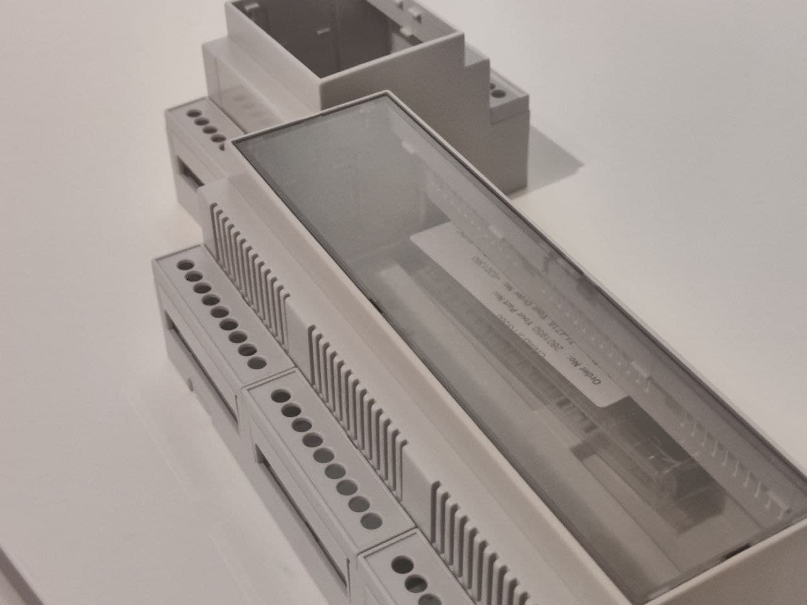
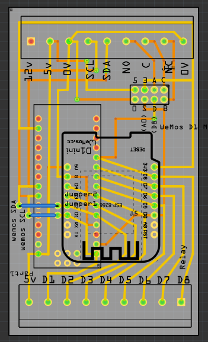
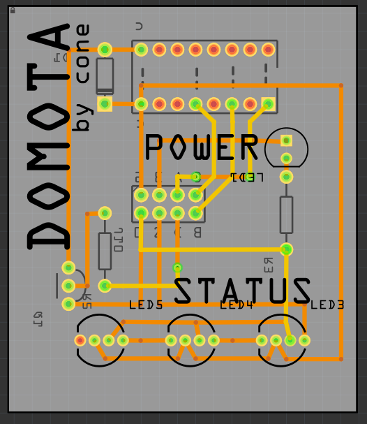

# Domota - a doorbot by cone
A modular, generic, and flexible DIN rail mounted entry system.
Ideal for hackerspaces and makerspaces!

### Physical System
Being moudlar, the system is designed to fit into Camden Boss DIN rail enclosures. Here's two - the controller in front (CNMB9) and the general purpose IO enclosure in the background (CNMB-3). 

## Circuit Diagrams
### General Purpose IO boards
The GPIO module has two boards inside.
#### Board 'A'
 This board
 * has screw terminals to real world inputs and outputs (locks, alarms, sensors, keypads) as well as communicaiton to other modules (i2c)
 * houses the MCU of choice (either an Arduino Nano, or a Wemos D1 Mini - depending on the application).
 * connects to board 'B'

**Board 'A'**

#### Board 'B'
This board is visible to the user through a window in the top of the enclosure.
It:
* Displays a power LED to indicate that the module has 5vpower, and that it's being rectified down to 3v3. This proves that a MCU has been inserted.
* Displays status LEDs - three WS2812D LEDs (all in one housing). These are addressable and custom programmable so each module can relay information to users such as
  * red, red, red = major error
  * orange, green, green = warning on outside
  * green green orange = warning on inside
  * 3 white = entry lights 
* Contains the relay - space saving feature for the relay to be on this board. Use some hot glue if mounding this board face up as the relay will then be upside down.
  
The socket labels are as follows:
* 0 = ground (0v)
* 5 = 5v
* 3 = 3v
* S = status
* D = relay
* C = relay common
* A = relay NC
* B = relay N0
  
**Board 'B'**

## System Overview
Places need entry systems. Commercial entry systems are often expensive, insecure and super proprietary.

Domota is a DIY approach using generic parts, easily swappable, maintainable, and tweakable.

#### The system is modular
* Modules communicate over i2c. They're physically close to eachother which keeps communication distances short. 
* Each module's boards are the same, but you can make them very custom by choosing which parts to use and which code to install.
*  As each module has the option of a relay, it's possible for multiple locks to be connected to the system.
* Locks can be wired in series or parallell so that any module can unlock or lock the door.

#### The system is generic 
* The parts used are generic and cheap. This is ideal when you don't want to spend £££.
* You can buy backups of each component so that if there's a disaster (flood, fire, curious screwdriver going in), you can quickly recover.
* Each module has the same hardware files, so you can cheaply manufacture 10 boards and have a full set up.

#### The system is flexible
* Modules talk over i2c so you can add multiple modules, each doing different things.
* You aren't constrained at the start - the system can grow and change as your requirements do.

## Parts
### Generic hardware interface board

Pins are mapped between the Wemos and Nano board:
* D0 = Status LED
* D1 = terminal (Wemos - SCL)
* D2 = ternimal (Wemos - SDA)
* D3...D7 = terminal for use
* D8 = terminal, and relay if fitted
* C / NC / NO - relay terminals, if relay fitted
* 12v - connector terminal, not used on the board but a good place to connect up peripherals using 12v.

Examples of what you can connect:
* Wiegand/RFID readers (12v, 0v, D0, D1, beep, led)
* Keypads (matrix, D1...D7, Col1-3, Row1-4)
* Swipe card readers
* Relays
* LED's
* Logic outputs for other systems

**If you find you're running out of pins, it's a sign you need to break out the module into more modules. Can matrices be converted to i2c?**

#### Hardware Files
CNMB3-A and CNMB3-B are the two physical boards. They fit, unsurprisingly, into the CNMB3 range of enclosures from Camden Boss which can be procured from Rapid.
* The A board is the lower board
* the B board is mounted by the enclosure window. 

#### Software Files
The software is in dev but is extremely basic. Examples will be uplaoded here when they're installed onto the prototypes. 
So far I've got a Wiegand reader to communicate a card ID to the board.
The library for I2c (Wire.h) is simple to use so connecting the two up will be easy.

All can be programmed using Arduino IDE and Arduino language.

Examples of what can be done with super basic software:
* Matrix to i2c
  * Keypad input is collected, and on pressing "Enter", the code is sent over i2c.
* Matrix to relay
  * Keypad input is collected, and on pressing "Enter", the code is chacked (HOTP, TOTP, list of codes etc), and a relay is fired
  * Use D1-D7 for matrix, D8 for relay, D0 for LED status (if using)
* RFID to i2c
* RFID to relay
* Button to relay
  * "push to exit" 
  * alarm system if door opened without pressing exit button
* Sensors to internet
  * use a wemos, and push to MQTT when events happen. 
* Internet to outputs
  * use a wemos, when MQTT message is received, fire a relay, change status LEDs, unlock door.
* Make noise
  * Connect alarms, buzzers to get attention - remote doorbells, timers, alarms. 

### Controller
The controller can act as a central point in more complex systems, or systems where you need Ethernet connections.

* It fits inside a larger enclosure, in this case CNMB-9, but you could make a custom board for their other enclosures.
* This is the master in i2c communication if using it
* The controller will oversee the various IOs and make decisions as needed. This breaks logic out and separates concerns.
* Python code can be auto run on the Pi on boot, which can start the system. The status LEDs will help the users know if the system is working. 

#### Hardware Files
It is assumed that 12v is available. This is because a 12v UPS is posisble fairly cheaply using 12v batteries that float at about 12v.
The board will rectify to 5v for modules and for the Pi. It will allow the Pi to be physically plugged in, keeping everything modular.

#### Software Files
The software has been written for a previous iteration of this project, but will need re-writing as the previous version communicated over Serial via USB. 
This will need changing to i2c.

Software is written in Python to keep it as open as possible to all.
